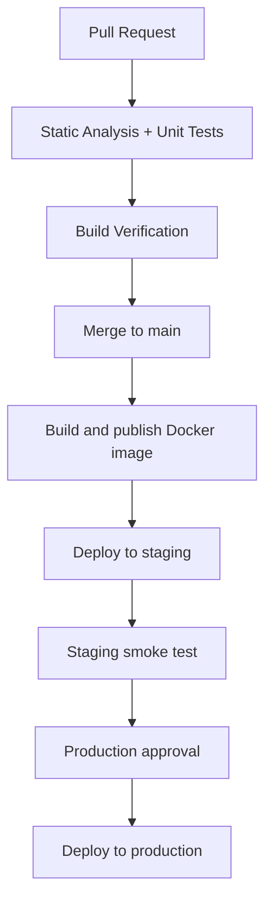

# Materials Calculator

Materials Calculator is a deliberately small [Streamlit](https://streamlit.io/) application for learning continuous integration and continuous deployment (CI/CD). It calculates density, estimates theoretical porosity, and converts pressure between MPa and GPa. The calculation logic is separate from the user interface, so learners can see how ordinary Python unit tests fit into a delivery pipeline.

The repository is designed for a 90-minute introductory session for material scientists who already know commits, branches, and pull requests. No external API or CI secret is required. GitHub automatically provides the deployment workflow with a short-lived `GITHUB_TOKEN` for publishing its image.

## Repository structure

```text
.
├── .github/workflows/
│   ├── ci.yml                 # Checks every pull request and main-branch push
│   └── deployment.yml         # Publishes and promotes a Docker image
├── .streamlit/config.toml     # Server address, port, and headless mode
├── src/
│   ├── __init__.py
│   ├── app.py                 # Streamlit interface only
│   └── calculations.py        # Independently testable formulas
├── tests/
│   ├── test_app_smoke.py
│   └── test_calculations.py
├── Dockerfile
├── pyproject.toml             # Package and tool configuration
├── requirements.txt           # Runtime dependencies
└── requirements-dev.txt       # Test and analysis dependencies
```

## Local setup and use

Python 3.11 and Git are required. Podman is optional for the local container exercise. GitHub-hosted runners use Docker in the automated workflows.

```bash
git clone <repository-url>
cd Calculator-app
python -m venv .venv
source .venv/bin/activate       # Windows PowerShell: .venv\Scripts\Activate.ps1
python -m pip install --upgrade pip
python -m pip install -r requirements-dev.txt
```

Start the app:

```bash
streamlit run src/app.py
```

Open <http://localhost:8501>. Stop it with `Ctrl+C`.

Run the browser-free unit and import smoke tests:

```bash
pytest
```

Run each static check independently. These commands only report problems; they do not rewrite files:

```bash
ruff check .
ruff format --check .
mypy src
bandit -c pyproject.toml -r src
flake8 src tests
pylint src
```

The equivalent local build-verification commands are:

```bash
python -m compileall src
python -c "import src.app"
podman build -t materials-calculator:local .
podman run --rm -p 8501:8501 --name materials-calculator materials-calculator:local
```

In another terminal, check the same endpoints used in automation:

```bash
curl --fail http://localhost:8501/_stcore/health
curl --fail http://localhost:8501/
```

Stop the foreground container with `Ctrl+C`.

## CI workflow

[`.github/workflows/ci.yml`](.github/workflows/ci.yml) runs for pull requests targeting `main` and pushes to `main`. Its three jobs make the quality gates visible on the Actions page:

1. **Static analysis** installs the development tools and runs Ruff linting, Ruff's format check, mypy, Bandit, Flake8, and Pylint as separate steps. Each analysis step uses `continue-on-error: true`, so a finding appears as a warning but does not block the lesson pipeline.
2. **Unit tests** uses `needs: static-analysis`, so it starts after static analysis finishes, and then runs pytest. Test failures are not ignored: they fail the job and stop the build.
3. **Build verification** uses `needs: [static-analysis, unit-tests]`. It installs runtime dependencies, compiles and imports the source, builds the image, starts a temporary container, and checks both Streamlit endpoints with curl.

Although Python is interpreted, compilation, import, packaging, and runtime checks provide a useful “build” gate. `actions/setup-python` also caches downloaded pip packages to speed up later runs. CI never applies auto-fixes.

## Deployment workflow

[`.github/workflows/deployment.yml`](.github/workflows/deployment.yml) runs after a push to `main`, or manually from **Actions → Build and deploy → Run workflow**.

- **Build and publish image** signs in to GitHub Container Registry (GHCR), builds once, and pushes lower-case image tags for both the commit SHA and `latest`.
- **Deploy to staging** selects the `staging` environment and clearly prints the image a real hosting command would deploy. It is intentionally a placeholder, not a real deployment.
- **Staging smoke test** pulls and starts that published commit-specific image on the runner. This simulates post-deployment validation because the example has no staging URL.
- **Deploy to production** selects the protected `production` environment and promotes the exact SHA-tagged image that passed staging. It does not rebuild the image. This is also an explicitly labelled placeholder.

The GHCR package may initially be private. The workflow can pull it using its automatic token; adjust the package visibility in the repository or organization settings if people should pull it anonymously.

## GitHub Actions vocabulary

- **Workflow:** an automated process described by one YAML file in `.github/workflows`.
- **Event (trigger):** repository activity that starts a workflow, such as a pull request, push, or manual `workflow_dispatch`.
- **Job:** a group of steps that runs on one fresh runner. Jobs can depend on one another with `needs`.
- **Step:** one named command or reusable action within a job. Steps share that job's checked-out files and runner.
- **Runner:** the temporary machine that executes a job; this project uses GitHub-hosted Ubuntu runners.
- **Action:** a reusable automation component, such as `actions/checkout`, referenced with `uses`.
- **Artifact:** a file produced by automation and retained or passed onward. The Docker image in GHCR is a durable build output; GitHub's `upload-artifact` action is not needed here.
- **Environment:** a named deployment target such as `staging` or `production`. It can hold protection rules, reviewers, variables, and environment-scoped secrets.
- **Secret:** an encrypted value exposed only to selected workflow steps. Never commit passwords or tokens. This example needs no user-created secrets because GitHub supplies `GITHUB_TOKEN`.

## Configure deployment environments

A repository administrator should create both environments before demonstrating deployment:

1. On GitHub, open the repository and choose **Settings → Environments**.
2. Select **New environment**, enter `staging`, and choose **Configure environment**.
3. Return to **Environments**, create `production`, and configure it.
4. In the production environment's **Deployment protection rules**, enable **Required reviewers**.
5. Select one or more users or teams who may approve production and save the rule. If available for the repository plan, enable **Prevent self-review** for a clearer approval exercise.

When the workflow reaches `deploy-production`, GitHub pauses the job until a required reviewer approves it. Environment protection features vary by GitHub plan and repository visibility; GitHub's environment settings page shows the options available to the repository.

No deployment credentials belong in this teaching repository. If real infrastructure is added later, put its credentials in environment-scoped secrets and replace only the labelled placeholder steps.

## What gets delivered?

- **Source code** is the human-readable Python, tests, configuration, and documentation stored in Git.
- **Python package** is installable Python code plus package metadata. `pyproject.toml` describes this project; packaging is useful for reuse but does not itself start a web server.
- **Docker image** is an immutable filesystem and startup definition containing Python, dependencies, configuration, and source code.
- **Running deployment** is a started instance of that image on infrastructure, with networking, configuration, monitoring, and a reachable URL.

Streamlit applications are normally delivered as source plus dependencies or as a Docker image, then run as a web service. They are not normally distributed as `.exe` files: users interact through a browser, the server must keep running, and container deployment preserves the Python/runtime environment consistently across machines. Desktop bundling tools exist, but an executable would obscure the web-service deployment lesson and still require special handling for the Streamlit server.

## End-to-end pipeline



A useful 90-minute lesson is: 15 minutes for the app and repository, 25 minutes for tests and static checks, 20 minutes for the CI jobs and `needs`, 20 minutes for Docker and staged deployment, and 10 minutes for a deliberate failure and questions.

## Demonstration scenarios

Create a disposable branch first so every experiment is safe and reviewable:

```bash
git switch -c demo/pipeline-failures
```

Run the named local command after introducing each failure, then undo the one-line change before moving to the next scenario. If the change has been committed, use a normal correcting commit; do not rewrite shared history.

### 1. Ruff linting failure

Add this unused import directly below the module docstring in `src/calculations.py`:

```python
import pathlib
```

Run `ruff check .`. Ruff reports `F401` for the unused import. Delete `import pathlib`, rerun the command, and commit the fix if desired.

### 2. mypy type-checking failure

Temporarily add this line immediately below `PressureUnit` in `src/calculations.py`:

```python
demo_count: int = "ten"
```

Run `mypy src`. It reports that `str` is incompatible with `int`. Delete the line, rerun mypy, and confirm success.

### 3. Failing unit test

In `tests/test_calculations.py`, change the expected value in `test_density_calculation` from `5.0` to `6.0`:

```python
assert calculate_density(20.0, 4.0) == pytest.approx(6.0)
```

Run `pytest`. The assertion fails because 20 ÷ 4 is 5. Restore `5.0` and rerun pytest.

### 4. Docker build failure

In `Dockerfile`, temporarily change:

```dockerfile
COPY requirements.txt .
```

to:

```dockerfile
COPY missing-requirements.txt .
```

Run `podman build -t materials-calculator:demo .`. Podman fails because that file is absent from the build context. Restore `COPY requirements.txt .` and rebuild.

Push the temporary branch and open a pull request to show the same failures in GitHub Actions. Finish by closing the pull request and deleting the branch, or merge only after all corrections pass.
